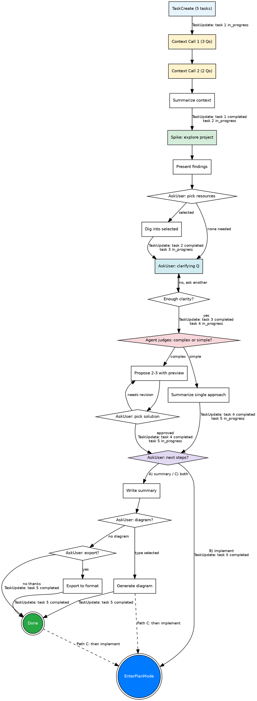

# Process Flow Diagram

```dot
digraph brainstorming {
    rankdir=TB;
    node [fontname="Helvetica", fontsize=10];
    edge [fontname="Helvetica", fontsize=9];

    // Initialization
    "TaskCreate (5 tasks)" [shape=box, style=filled, fillcolor="#e8f4fd"];

    // Step 0 - Context
    "Context Call 1 (3 Qs)" [shape=box, style=filled, fillcolor="#fff3cd"];
    "Context Call 2 (2 Qs)" [shape=box, style=filled, fillcolor="#fff3cd"];
    "Summarize context" [shape=box];

    // Step 1 - Spike
    "Spike: explore project" [shape=box, style=filled, fillcolor="#d4edda"];
    "Present findings" [shape=box];
    "AskUser: pick resources" [shape=diamond];
    "Dig into selected" [shape=box];

    // Step 2 - Clarify
    "AskUser: clarifying Q" [shape=box, style=filled, fillcolor="#d1ecf1"];
    "Enough clarity?" [shape=diamond];

    // Step 3 - Propose
    "Agent judges: complex or simple?" [shape=diamond, style=filled, fillcolor="#f8d7da"];
    "Propose 2-3 with preview" [shape=box];
    "AskUser: pick solution" [shape=diamond];
    "Summarize single approach" [shape=box];

    // Step 4 - Final
    "AskUser: next steps?" [shape=diamond, style=filled, fillcolor="#e2d9f3"];
    "Write summary" [shape=box];
    "AskUser: diagram?" [shape=diamond];
    "Generate diagram" [shape=box];
    "AskUser: export?" [shape=diamond];
    "Export to format" [shape=box];
    "Done" [shape=doublecircle, style=filled, fillcolor="#28a745", fontcolor=white];
    "EnterPlanMode" [shape=doublecircle, style=filled, fillcolor="#007bff", fontcolor=white];

    // Flow
    "TaskCreate (5 tasks)" -> "Context Call 1 (3 Qs)" [label="TaskUpdate: task 1 in_progress"];
    "Context Call 1 (3 Qs)" -> "Context Call 2 (2 Qs)";
    "Context Call 2 (2 Qs)" -> "Summarize context";
    "Summarize context" -> "Spike: explore project" [label="TaskUpdate: task 1 completed\ntask 2 in_progress"];

    "Spike: explore project" -> "Present findings";
    "Present findings" -> "AskUser: pick resources";
    "AskUser: pick resources" -> "Dig into selected" [label="selected"];
    "AskUser: pick resources" -> "AskUser: clarifying Q" [label="none needed"];
    "Dig into selected" -> "AskUser: clarifying Q" [label="TaskUpdate: task 2 completed\ntask 3 in_progress"];

    "AskUser: clarifying Q" -> "Enough clarity?";
    "Enough clarity?" -> "AskUser: clarifying Q" [label="no, ask another"];
    "Enough clarity?" -> "Agent judges: complex or simple?" [label="yes\nTaskUpdate: task 3 completed\ntask 4 in_progress"];

    "Agent judges: complex or simple?" -> "Propose 2-3 with preview" [label="complex"];
    "Agent judges: complex or simple?" -> "Summarize single approach" [label="simple"];
    "Propose 2-3 with preview" -> "AskUser: pick solution";
    "AskUser: pick solution" -> "Propose 2-3 with preview" [label="needs revision"];
    "AskUser: pick solution" -> "AskUser: next steps?" [label="approved\nTaskUpdate: task 4 completed\ntask 5 in_progress"];
    "Summarize single approach" -> "AskUser: next steps?" [label="TaskUpdate: task 4 completed\ntask 5 in_progress"];

    "AskUser: next steps?" -> "Write summary" [label="A) summary / C) both"];
    "AskUser: next steps?" -> "EnterPlanMode" [label="B) implement\nTaskUpdate: task 5 completed"];
    "Write summary" -> "AskUser: diagram?";
    "AskUser: diagram?" -> "Generate diagram" [label="type selected"];
    "Generate diagram" -> "Done" [label="TaskUpdate: task 5 completed"];
    "AskUser: diagram?" -> "AskUser: export?" [label="no diagram"];
    "AskUser: export?" -> "Export to format" [label="yes"];
    "Export to format" -> "Done" [label="TaskUpdate: task 5 completed"];
    "AskUser: export?" -> "Done" [label="no thanks\nTaskUpdate: task 5 completed"];

    // Path C continuation
    "Generate diagram" -> "EnterPlanMode" [label="Path C: then implement", style=dashed];
    "Done" -> "EnterPlanMode" [label="Path C: then implement", style=dashed];
}
```
